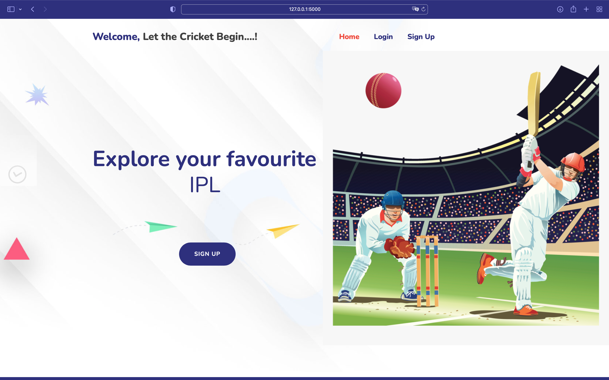
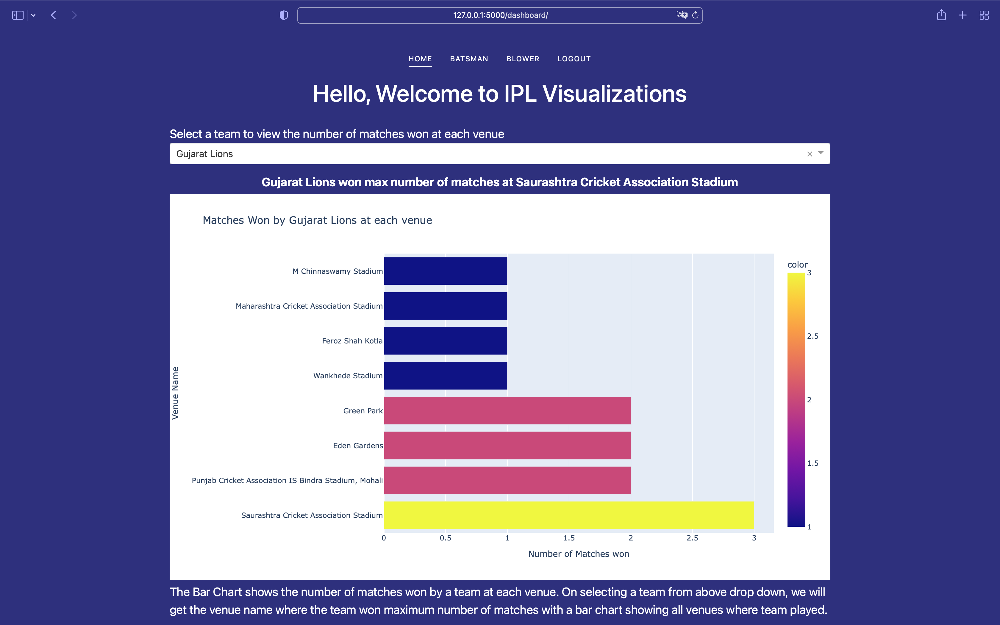
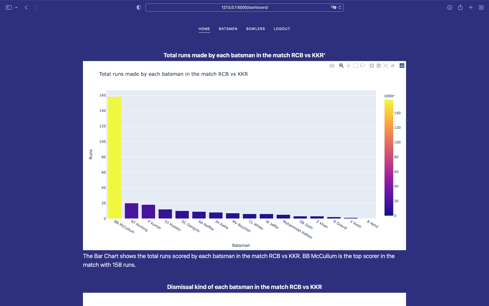
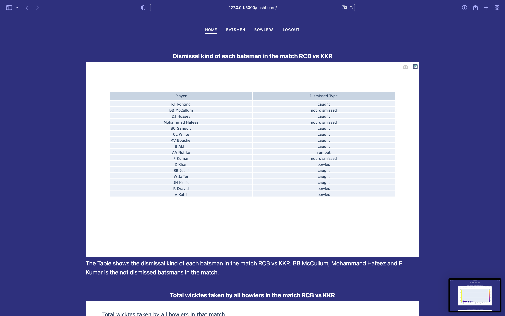
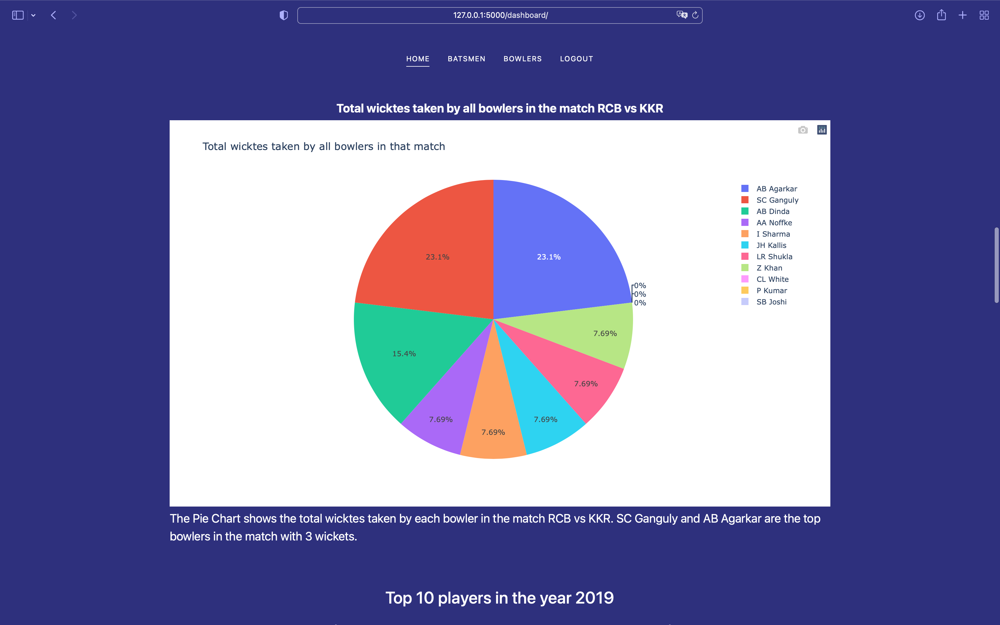
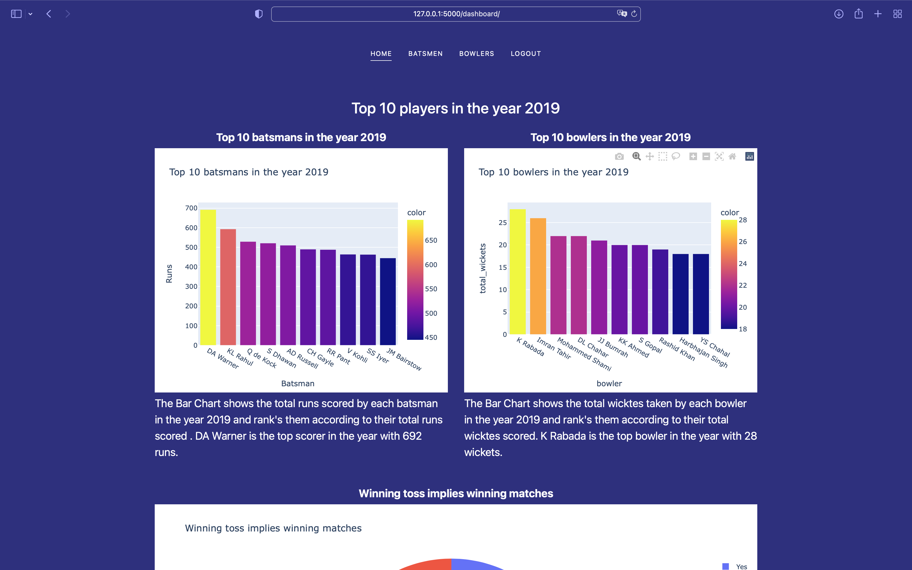

# ipl_vis

Visualizations and Dashboards with exploratory data analysis to find really cool insights about IPL

I have summarized and extracted information from IPL dataset and performed exploratory data analysis

In this project I have used a IPL dataset consists of matches and deliveries. 

I used the data to perform data preprocessing with Pandas. 

Performed various data analysis on the dataset and created a dashboard with all visualizations (like bar chart, pie chart and other) and extracted some data insights.

# Technologies Used 

Flask as a backend application server

MySQL database to store the dataset and fetch data from there by using SQL Alchemy

Pandas for preprocessing data from database and updating the database

Dash from plotly to create visualizations and dashboards with visualizations.

Firebase for user authentication and storing user data

# Installation

Clone the project
```
git clone https://github.com/manisaiprasad/ipl_vis
```
Create a new virtual environment
```
cd ipl_vis
python3 -m venv env
source env/bin/activate
```
Instaling requriments
```
pip install -r requriments.txt
```
Running the flask app
```
export FLASK_APP=main.py
export FLASK_ENV=development
flask run -h 0.0.0.0
```

# Screenshots









